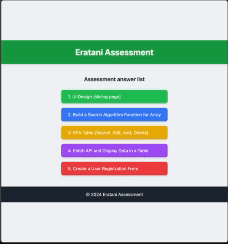

# Assessment Task Solution

This React application is designed to demonstrate solutions to a series of assessment tasks. 

The app features a homepage with a list of tasks, each redirecting to a separate page where the respective task is implemented.

## Overview

The application is structured to address the following assessment tasks:

1.	Design UI
2.	Search Algorithm
3.	Editable Table (CRUD)
4.	API Data Table
5.	Register User

## Demo

Below is a demo of the user registration process:




### How to Run the Application
#### 1.	Clone the repository:


```bash
git clone https://github.com/haryanapnx/eratani-assessment.git

cd eratani-assessment
```


####  2.	Install dependencies:
```bash 
npm install 
```
#### 3.	Start the development server:
```bash 
npm start 
```

### Technologies Used
- React
- Tailwind CSS
- React-Router
